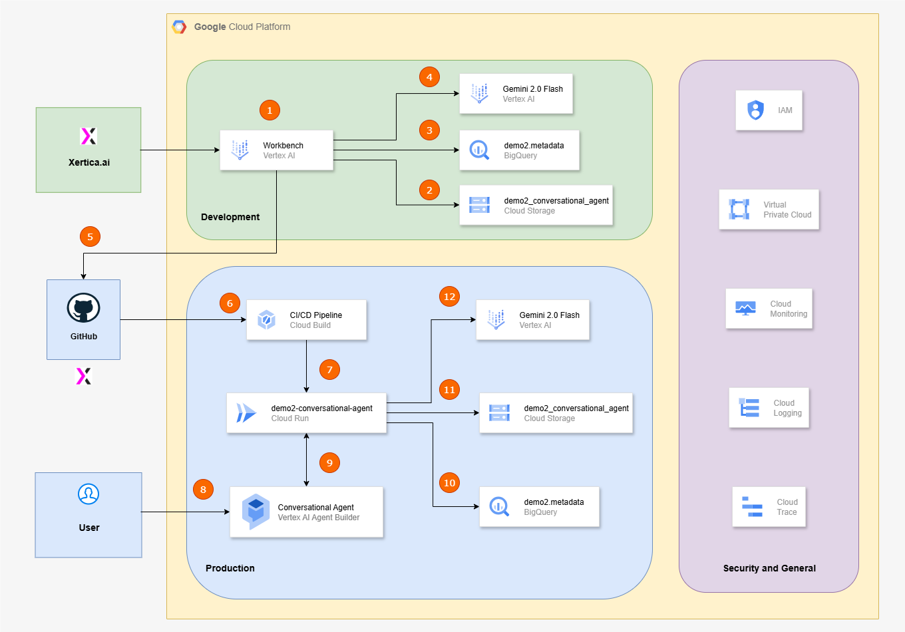

# Demo 2 - Conversational Agent for Judicial Processes on Google Cloud Platform (EM DESENVOLVIMENTO)

The Conversational Agent described in this Demo examplifies the Conversational Agent currently in production in the platform developed by Xertica.ai to the Public Ministry of Rio Grande do Sul. Due to the nature of the work in a Public Ministry, dealing with confidential legal processings, the exact content of the codes and data cannot be shared.

The main objective of the solution is to assist prosecutors and attorneys by providing a Conversational Agent capable of dialoguing with the structured and unstructured data of a legal process.

The following architecture diagram ilustrates the principal Google Cloud Platform (GCP) systems and components used for developing, deploying, and operating the Conversational Agent leveraging structured data, unstructured documents, and a large language model (LLM - Currently Gemini 2.0 Flash) to answer user queries, specifically within the context of a judicial case. 

**Architecture Diagram:**

The infrastructure is divided into three main environments: **Development**, **Production**, and **Security and General**, each listed below with their components and **Good Practices** used to choose, design, and deploy the solution using these components.

## Development Environment (Green Box)

This section focuses on building and refining the core components of the chatbot.

1.  **Xertica.ai -> Workbench (Vertex AI):**
    * **Xertica.ai:** Development team initiates the development process.
    * **Workbench (Vertex AI):** Managed development environment (Instance) within Vertex AI. The central hub used for the data scientists and developers to write code, develop Gen AI solutions, and perform data analysis.

2.  **Workbench (Vertex AI) -> Cloud Storage:**
    * Developers in the Workbench interact with Cloud Storage.
    * **Cloud Storage:** This is where the full process PDF files for judicial cases are stored. These are unstructured data.
    * **Good Practice:** Cloud Storage offers high durability, availability, and scalability for storing large volumes of data, which can be the case for many legal processes. Granular access controls (IAM) is applied to ensure only authorized personnel and services can access these sensitive documents. Data encryption at rest (default or customer-managed encryption keys - CMEK) and in transit is crucial for judicial data.

3.  **Workbench (Vertex AI) -> BigQuery:**
    * Developers query BigQuery from the Workbench.
    * **BigQuery:** This data warehouse stores structured metadata about judicial cases. This metadata includes, but is not limited to, case numbers, parties involved, dates, types of proceedings, and pointers to the relevant PDF files in Cloud Storage.
    * **Good Practice:** BigQuery provides a highly scalable and cost-effective solution for storing and querying large datasets of structured judicial information. It also offers data masking and tokenization for PII.

4.  **Workbench (Vertex AI) -> Gemini 2.0 Flash (Vertex AI):**
    * Developers experiment and integrate with the LLM from the Workbench.
    * **Gemini 2.0 Flash (Vertex AI):** This is the large language model used for understanding user queries and generating answers based on the provided context (from BigQuery metadata and PDFs content). 
    * **Good Practice:** Using Gemini via Vertex AI ensures that the LLM is managed, scalable, and has built-in security features and responsible AI tools. Developers also implement guardrails to ensure the answers generated are accurate and safe.

## Production Environment (Blue Box)

This section details the automated deployment and operational aspects of the chatbot.

5.  **Xertica.ai -> GitHub:**
    * **GitHub:** The source code repository. After development in the Workbench, code (e.g., Python scripts for data processing, chatbot logic, prompt engineering) is pushed to GitHub.
    * **Good Practice:** GitHub (or any version control system) is essential for collaborative development, versioning, and managing code changes. It's the starting point for the CI/CD used in the solution.

6.  **GitHub -> CI/CD Pipeline (Cloud Build):**
    * **CI/CD Pipeline (Cloud Build):** When changes are pushed to GitHub (e.g., to the environment's branch), Cloud Build is triggered.
    * **CI/CD Purpose:** This pipeline automates the building of container images, running tests, and preparing the application for deployment.
    * **Good Practice:** Automating CI/CD ensures consistent deployments, reduces human error, and accelerates the release cycle. Cloud Build's integration with GitHub and other GCP services is seamless. 

7.  **CI/CD Pipeline (Cloud Build) -> Cloud Run:**
    * The CI/CD pipeline deploys the code for the chatbot application to Cloud Run. 
    * **Cloud Run Role:** This service hosts the core logic of the chatbot, responsible for receiving user queries, orchestrating calls to other services, and formatting responses.
    * **Good Practice:** Cloud Run provides automatic scaling (from zero to many instances), eliminates infrastructure management, and is highly cost-effective. 

8.  **User -> Conversational Agent (Vertex AI Agent Builder):**
    * **User:** The end-user interacts with the chatbot.
    * **Conversational Agent (Vertex AI Agent Builder):** This is the user-facing component of the chatbot. Vertex AI Agent Builder is used to build and deploy the conversational AI agent (using Conversational Agent/Dialogflow CX). 
    * **Good Practice:** Vertex AI Agent Builder provides a robust framework for building conversational experiences, including handling intents, entities, and complex dialogue flows. It integrates well with other Vertex AI services and has the option of calling webhooks, such as the Cloud Run service.

9.  **Conversational Agent (Vertex AI Agent Builder) -> Cloud Run:**
    * The Conversational Agent sends user requests to the Cloud Run service (webhook). This is where the core logic resides.
    * **Flow:** The agent parses the user's query, identifies the intent, and then calls the Cloud Run service to get the relevant information.

10. **Cloud Run -> BigQuery:**
    * The Cloud Run service queries BigQuery to retrieve structured metadata related to the judicial case based on the user's query (e.g., case number).

11. **Cloud Run -> Cloud Storage:**
    * The Cloud Run service retrieves the PDF documents from Cloud Storage using the pointer obtained from BigQuery.

12. **Cloud Run -> Gemini 2.0 Flash (Vertex AI):**
    * After retrieving structured metadata from BigQuery and the PDFs from Cloud Storage, the Cloud Run service orchestrates a prompt to Gemini 2.0 Flash. This prompt includes the user's question, the relevant metadata, the content from the PDFs, and other information regarding the process .
    * **Gemini's Role:** Gemini then processes this information to generate a comprehensive and accurate answer to the user's query.
    * **Good Practice:** This interaction involves careful prompt engineering to ensure Gemini understands the context and generates relevant, factual, and safe responses. The log of all generated responsed is also monitored for quality and safety.

## Security and General (Purple Box)

Beyond the specific components mentioned above for developing and deploying, here are overarching security and other General components used in the demo and the final solution:

* **Identity and Access Management (IAM):**
    * Implemented the **Principle of Least Privilege (PoLP)**: Granting only the necessary permissions to users and service accounts for each resource.
    * Use **Service Accounts** for inter-service communication (e.g., Cloud Run accessing BigQuery, Cloud Storage, Gemini).
    * Leverage **IAM Conditions** for more granular access control.
    * Regularly **audit IAM policies**.

* **Identity and Access Management (IAM)**
    * The **Principle of Least Privilege (PoLP)** is rigorously applied, granting only the essential permissions to users and service accounts for each resource. **Service Accounts** are exclusively used for inter-service communication (e.g., Cloud Run accessing BigQuery, Cloud Storage, Gemini). **IAM Conditions** are leveraged to achieve highly granular access control, and **IAM policies** are regularly audited.
* **Networking**
    * **VPC Service Controls** establish security perimeters around sensitive data and services like BigQuery, Cloud Storage, and Vertex AI, effectively preventing data exfiltration. **Private Service Connect** or **VPC Access Connector** is configured for private communication between services where public internet exposure is not required (e.g., Cloud Run to BigQuery). **Firewall Rules** are implemented to restrict network access as needed.
* **Data Security**
    * Encryption at Rest and in Transit** is enabled by default for all data in Cloud Storage and BigQuery. Customer-Managed Encryption Keys (CMEK) are used for additional control over encryption keys for highly sensitive judicial data. The **Data Loss Prevention (DLP) API** scans judicial documents for sensitive information, redacting or tokenizing it before storage or processing when necessary. **Data Masking/Tokenization** is applied to sensitive PII within BigQuery.
* **Observability (Monitoring, Logging, Tracing)**
    * **Cloud Monitoring** dashboards and alerts are configured for service health, performance, and resource utilization (e.g., Cloud Run latency, BigQuery query performance, Vertex AI model usage). **Cloud Logging** centralizes all application and infrastructure logs for debugging, auditing, and security analysis. **Cloud Trace** is utilized to understand latency and execution flow across distributed services.
* **Cost Management**
    * Serverless services (Cloud Run, Cloud Build, BigQuery, Vertex AI) are leveraged for their pay-per-use billing model, optimizing costs. **Billing alerts** are set up, and spending is continuously monitored. **Resource quotas** are implemented to prevent unexpected cost spikes.
* **Reliability and Disaster Recovery**
    * The architecture is designed for **multi-region deployment** or at least multi-zone within a region for critical components to enhance availability. **Backup and recovery strategies** are implemented for data in BigQuery and Cloud Storage.
* **Responsible AI**
    * For the Gemini model, **responsible AI best practices** are integrated, including:
* **Bias detection and mitigation:** Model outputs are continuously evaluated for fairness.
* **Safety filters:** Responses are ensured to be free of harmful, unethical, or illegal content.
* **Transparency and explainability:** Where possible, clarity is provided on how the chatbot arrived at an answer.
* **Human oversight:** Mechanisms are in place for human review of challenging or critical responses.
* **Compliance**
    * Given the judicial context, compliance with relevant data privacy regulations (e.g., **LGPD in Brazil, GDPR in Europe**) and industry-specific legal requirements is ensured. GCP's various compliance certifications are leveraged.

This architecture provides a robust, scalable, and secure foundation for a sophisticated judicial chatbot, adhering to modern cloud development and operational principles.

&copy; 2025 Xertica.ai. All rights reserved 
