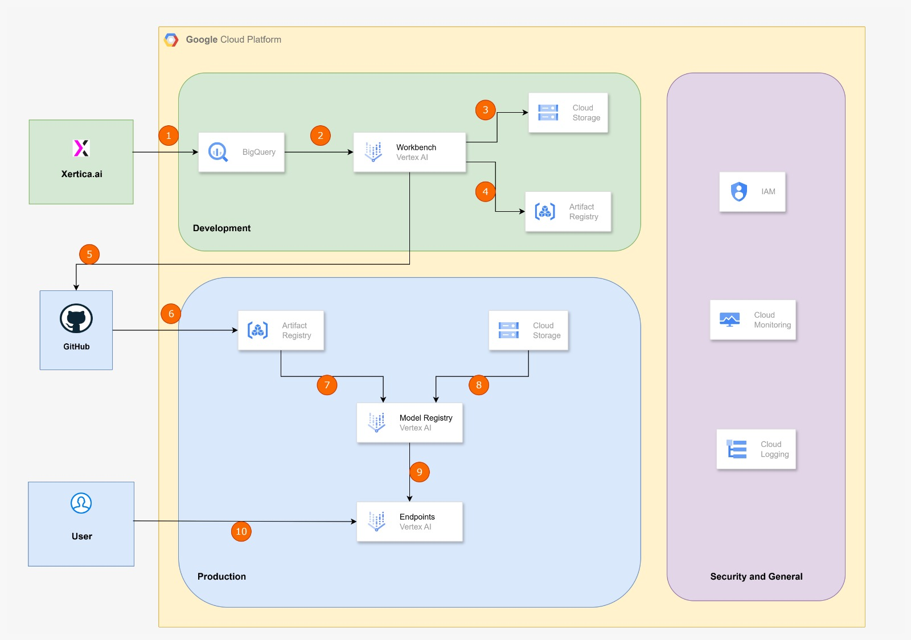

## Demo 4 - SARIMA-Powered Intelligent Process Forecaster for MPRS

This project demonstrates a time-series forecasting solution using a SARIMA model, packaged and deployed on the Google Cloud Platform (GCP) to serve online predictions.

The demo uses Chicago taxi trip data to illustrate the development and deployment process. However, the workflow presented is a direct replication of what is being implemented in production for the Public Prosecutor's Office of Rio Grande do Sul (MPRS).

The MPRS’s and Xertica.ai' primary objective is to proactively forecast the daily influx of new legal processes and related files. By leveraging a time-series forecasting solution, similar to the approach demonstrated in the Chicago taxi scenario, MPRS can optimize both infrastructure on Google Cloud Platform (GCP) and the allocation of human resources, ensuring teams are prepared to handle the anticipated workload efficiently while generating strategic insights from decentralized legal data sources.

The following architecture diagram illustrates the main Google Cloud Platform (GCP) systems and components used to develop, deploy, and operate the time series forecasting solution.

**Architecture Diagram:**

The infrastructure is divided into three main environments: **Development**, **Production**, and **Security and General**, each listed below with its components and the **Good Practices** used.

### Development Environment (Green Box)

This section focuses on building and packaging the model and the container.

1.  **Xertica.ai → BigQuery (Step 1):**

      * **Xertica.ai:** The development team initiates the data preparation process.
      * **BigQuery:** BigQuery stores the time series data. Pre-processing is performed directly here using SQL to ensure the data is ready for model training.
      * **Good Practice:** BigQuery is ideal for this step due to its scalability and ability to process large volumes of data efficiently and cost-effectively, using SQL queries for pre-processing.

2.  **BigQuery → Workbench (Vertex AI) (Step 2):**

      * **Workbench (Vertex AI):** This is the managed development environment where the Python code for training the SARIMA model is executed. The Workbench connects to BigQuery to extract the pre-processed data.
      * **Good Practice:** Using Vertex AI Workbench provides a cohesive and integrated development environment with other Vertex AI services.

3.  **Workbench (Vertex AI) → Cloud Storage (Step 3):**

      * The trained SARIMA model (`model.pkl`) is serialized and stored in **Cloud Storage**. This serves as the model artifact repository.
      * **Good Practice:** Cloud Storage offers high durability, availability, and is the standard and secure method for storing model artifacts for Vertex AI.

4.  **Workbench (Vertex AI) → Artifact Registry (Step 4):**

      * From the Workbench, the inference code (`predictor.py`), `Dockerfile`, and dependencies (`requirements.txt`) are used to build the container image. This image is then pushed to the **Artifact Registry**.
      * **Good Practice:** Artifact Registry provides a secure and private repository for container images, with native integration with GCP.

### Production Environment (Blue Box)

This section details the automated deployment and operation of the model for serving predictions.

5.  **GitHub → Artifact Registry / Cloud Storage (Steps 5 & 6):**

      * **GitHub:** The inference application's source code resides in a GitHub repository. Changes in this repository can trigger CI/CD pipelines (not explicitly shown, but implied in the flow).
      * **Good Practice:** Version control is essential for collaboration and for automating the creation of new container images and updating model artifacts.

6.  **Artifact Registry & Cloud Storage → Model Registry (Vertex AI) (Steps 7 & 8):**

      * **Model Registry (Vertex AI):** The **Model Registry** is the central catalog where the model is registered. It associates the model artifact (`model.pkl`) from **Cloud Storage** with the container image from **Artifact Registry** to create a complete `Model` resource.

7.  **Model Registry → Endpoints (Vertex AI) (Step 9):**

      * The `Model` resource is deployed to a **Vertex AI Endpoint**. Your container's `predictor.py` script is executed, which downloads `model.pkl` from Cloud Storage. The `/health` endpoint ensures the service is ready to receive traffic only after the model is loaded.
      * **Good Practice:** Vertex AI Endpoints provide infrastructure management, auto-scaling, and monitoring, simplifying production operations.

8.  **User → Endpoints (Vertex AI) (Step 10):**

      * The end-user sends prediction requests to the **Vertex AI Endpoint**. The endpoint forwards the request to your custom container to generate the response.

### Security and General (Purple Box)

This section covers the security and operational components that support the solution.

  * **IAM (Identity and Access Management):**
      * Manages permissions, ensuring that only authorized service accounts and users can access resources like BigQuery and Cloud Storage.
  * **Cloud Monitoring & Cloud Logging:**
      * **Cloud Logging** centralizes your application logs (generated by `predictor.py`), making debugging easier. **Cloud Monitoring** tracks performance metrics and sends alerts.

&copy; 2025 Xertica.ai. All rights reserved 